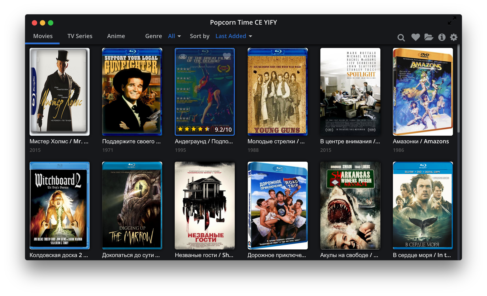

### Russian films provider for Popcorn Time
[](https://travis-ci.org/lafin/ru-yts)
___



### Install
Need install [Docker](https://docs.docker.com/compose/install/)
```
$ mkdir yts && cd yts
$ mkdir db log
$ curl -O https://raw.githubusercontent.com/lafin/ru-yts/master/docker-compose.x86_64.yml
$ docker-compose -f docker-compose.x86_64.yml up
```

### Update
```
$ cd yts
If you use older version (until 5.11.2016) you should remove db folder because older version use different schemas for db
$ rm -rf ./log/* ./db/*
$ docker-compose -f docker-compose.x86_64.yml pull
$ docker-compose -f docker-compose.x86_64.yml up
```

### If you want to add many films
```
$ docker run --rm --link yts_mongo_1:mongo lafin/ru-yts:x86_64 --only-worker -c 3
```
* _yts_mongo_1_ - name of docker container for mongodb (you can see list containers use the command ```docker-compose -f docker-compose.x86_64.yml ps``` just find ```Name``` with *_mongo_1)
* _10_ - count page (I'm not recommend set more then 100) by default 1
* you can set number of page from which start parsing with use the ```-s``` by default 1
* you can set ttl ```--ttl``` by default 86400 seconds

### Setup
Download last version Popcorn Time [here](http://popcorntime.ag) Into the setting of Popcorn Time need set address for you yts server (eg. Movie API Endpoint: http://127.0.0.1:3000/)

### Contributors

 * Author: [lafin](https://github.com/lafin)

### License

  MIT
